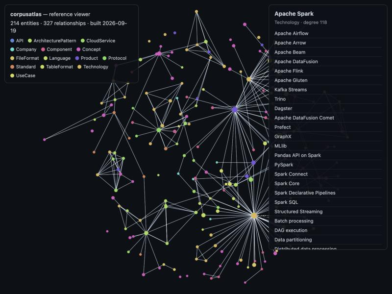

# corpusatlas

[](https://github.com/anothernoise/corpusatlas/actions/workflows/ci.yml)
[](LICENSE)
[](pyproject.toml)

Turn a corpus of markdown and structured data into a knowledge graph you can
ship as a static file.

Built for the case described in
[Build-Time Knowledge Graphs](https://shirokoff.ca/blog/build-time-knowledge-graph):
a few hundred to a few thousand documents, where the whole graph fits in a
browser tab and a graph database would be an operational cost with no payoff.
[docs/DESIGN.md](docs/DESIGN.md) has the reasoning condensed for this repo —
the size table, why entity resolution is the real work, and what's actually
flexible here versus fixed on purpose.

## The contract

Two rules keep this a module rather than a framework:

1. **Sources are adapters.** Every adapter yields the same `Document` shape.
   The core never learns the name of your blog, your book, or your CMS. Ships
   with five: a directory of rendered HTML (`html_blog`), the Architecture
   Radar's scorecards and dated entries, curated entity packs, and a plain
   list of URLs (`web`) for a corpus that isn't a local checkout at all — see
   `corpusatlas/adapters/web.py` for what that one honestly does and doesn't
   extract. A new source is a class with one `documents()` method; the
   existing five are the reference for the shape.
2. **Output is files.** `corpusatlas` writes `graph.json` and exits. It owns no
   process, serves no requests, and has no opinion about what reads the output.

```
adapters → resolve → extract (deterministic, then curated) → merge → graph.json
```

## Install and run

No third-party dependencies. Python 3.11+.

```bash
pip install git+https://github.com/anothernoise/corpusatlas@v0.4.0

corpusatlas build --config your-corpus.toml --out graph.json
corpusatlas stats    --graph graph.json
corpusatlas validate --graph graph.json
```

`example.toml` shows the config shape but points at a real corpus's
directories, so it isn't runnable as-is — see Configuration below.

Working on the module itself:

```bash
pip install -e .          # installs the `corpusatlas` console script
python tests/run.py       # invariant tests, stdlib only
```

`python3 -m corpusatlas …` works too, without installing — the console script
and the module entry point are the same `main()`.

## Configuration

```toml
[[sources]]
type     = "html_blog"          # adapter name
path     = "../blog"
url_base = "/blog/"

[[sources]]
type = "radar_scorecards"
path = "../architecture-radar/scorecards.json"

[[sources]]
type = "radar_entries"
path = "../architecture-radar/radar.json"

[[sources]]
type     = "entity_packs"
path     = "entities"
url_base = "/knowledge-base/entities/"

[ontology]
entities = "entities.toml"

# Packs cite their sources by URL; the graph joins on document id. This says
# how to get from one to the other, and defaults to the values below minus
# site_url — a corpus published under /blog/ can leave the section out.
[packs]
site_url             = "https://example.org"
blog_prefix          = "/blog/"
assessment_prefix    = "/architecture-radar/"
assessment_id_prefix = "assessment:"
```

Every path resolves relative to the config file, so the config lives with the
corpus and this module stays portable. See `example.toml`.

## Ontology

Two kinds of node, and the split is the design:

- **Entities** are what the graph is about. `DEFAULT` (this package's own,
  used unless a build says otherwise) has 14 types: `Concept`,
  `ArchitecturePattern`, `Technology`, `Component`, `Language`, `API`,
  `Protocol`, `Standard`, `FileFormat`, `TableFormat`, `Product`,
  `CloudService`, `Company` and `UseCase`. Ids are type-neutral
  (`entity:<slug>`), so reclassifying something never changes its id.
- **Context** is where claims were published: `Document` (an article),
  `Assessment`, `RadarEntry` and `Topic`.

Semantic relations (`IMPLEMENTS`, `HAS_COMPONENT`, `READS`, `RUNS_ON`,
`MANAGED_BY`, `ALTERNATIVE_TO`, ...) join entities. Context relations
(`COVERS`, `HAS_RADAR_ENTRY`, `ASSESSES`, ...) join entities to their
evidence. `corpusatlas validate` refuses a semantic edge that touches a
context node. The artifact carries `entity_types` and `inverse_labels`, so a
renderer never hard-codes the split.

**The vocabulary itself is an `Ontology` value, not a fixed set of
constants.** `DEFAULT` is a data-and-infrastructure-architecture ontology,
built for this package's own use, and every extractor, the resolver and
`write_graph` take an `ontology=` parameter and use it instead of reaching
for a module global — which is what lets a build actually swap it out. A
corpus about something else entirely — cooking, case law, whatever — gets its
own types and relations from a schema file:

```toml
# in your corpus's config
[ontology]
entities = "entities.toml"   # unchanged: named instances of the types below
schema   = "ontology.toml"   # new: the types and relations themselves
```

See [docs/ontology-schema.md](docs/ontology-schema.md) for the file format
and a complete worked example, and [docs/DESIGN.md](docs/DESIGN.md) for why
the id scheme and the three extraction tiers stay fixed regardless — those
are structural, not vocabulary.

The **entity registry** (`entities.toml`) is the vocabulary. It gives each
entity a name, type, aliases and links. It also lists the scorecard options,
radar entries and blog tags that name the entity, so one option can name two
entities ("Druid / Pinot"):

```toml
[[entity]]
id      = "apache-druid"
name    = "Apache Druid"
type    = "Technology"
options = ["Apache Druid", "Druid / Pinot"]
case_sensitive = true      # text matching respects case
```

## Extraction tiers

Three tiers run in order, and merge keeps the first writer. A later tier can
add links, aliases and descriptions to an entity, but never change its label
or type.

**Deterministic.** Links, tags, scorecards and radar entries, resolved
through the registry. Exact, free and instant.

**Curated: entity packs.** One JSON file per subject: typed entities, and
typed relationships, each with a confidence and an explanation. Packs are
drafted offline and machine-checked. Nothing in the build calls a model. A
pack is yielded as a `Document`, so every curated edge names its pack, and
deleting the file retracts all of it. An ill-typed relationship, or one that
contradicts the registry, fails the build.

**Extracted: mentions.** Word-boundary matching of every entity's name and
aliases over article text, with a minimum-occurrence bar. Companies are not
matched. It produces `COVERS` edges tagged `extracted`. No model; the output
is byte-identical on every run.

## Provenance

Every edge carries where it came from:

```json
{
  "src": "entity:clickhouse", "rel": "COMPARES_TO", "dst": "entity:starrocks",
  "prov": { "doc": "starrocks-vs-clickhouse-vs-doris", "tier": "deterministic",
            "extractor": "deterministic@2", "via": "scorecard" }
}
```

An edge is a claim made *by* a document. When the document goes, the claim goes
with it — `merge.py` handles retraction, not just append.

## Looking at the output

`viewer/index.html` is a ~150-line reference renderer, not a library: one
static ForceAtlas2 layout, type-coloured nodes, click a node to see its
neighbours. No live simulation, no drag, no URL routing — the production
renderer this was pulled from is ~1900 lines for exactly those, tuned for one
specific graph's shape rather than written to be generic. Point it at any
`graph.json` this module built and it will render — it reads only the fields
`emit.py` documents (`entity_types`, `nodes[].type`, `.degree`, `.url`), never
this ontology's specific type names.



```bash
corpusatlas build --config your-corpus.toml --out viewer/graph.json
python3 -m http.server 8000    # from wherever viewer/ and graph.json both are
# open http://localhost:8000/viewer/
```

(`example.toml`'s paths point at a real corpus's directories, so it won't
build on its own inside a clone of this repo — swap in your own config, or
pass `?graph=<url>` to point the viewer at any already-built `graph.json`,
shirokoff.ca's included.)

## Other formats

`graph.json` stays the artifact `build` writes — it's what the browser reads
with zero transformation, and every other format here is a converter over
it, not a second thing the pipeline produces. `convert` never re-runs
extraction, so it works on any `graph.json` this module ever wrote:

```bash
corpusatlas convert --graph graph.json --format graphml --out graph.graphml
corpusatlas convert --graph graph.json --format csv --out-dir csv/
```

GraphML opens directly in Gephi, yEd, NetworkX (`nx.read_graphml`) or igraph
— real graph analysis tools, not a browser view. The CSV pair
(`nodes.csv`/`edges.csv`) is for reach rather than fidelity: pandas, a
spreadsheet, anything with a CSV reader. Both keep the same lean column set —
a node's label, type, degree and url; an edge's relation, confidence,
explanation and scope — rather than trying to be the complete record;
`graph.json` still is that, provenance and all.

Turtle/RDF was considered and set aside: unlike these two, it isn't a
converter over the same fields — mapping confidence and provenance onto RDF
means picking namespaces and deciding between reification and named graphs,
a modelling decision rather than a format choice. Worth doing if something
needs to `SPARQL` this graph; not worth doing speculatively.

## Used by

[shirokoff.ca/knowledge-base](https://shirokoff.ca/knowledge-base/) builds its
graph with this module in CI on every push: ~290 articles, 16 scored
assessments and a set of curated entity packs become one `graph.json`, rendered
as an interactive canvas and as a
[plain-HTML list](https://shirokoff.ca/knowledge-base/entities). The site holds
the corpus, the config and the entity registry; this repo holds the engine.

It grew inside that site's repository and was split out with
`git subtree split`, so the history below predates this repository.

## Licence

MIT.
