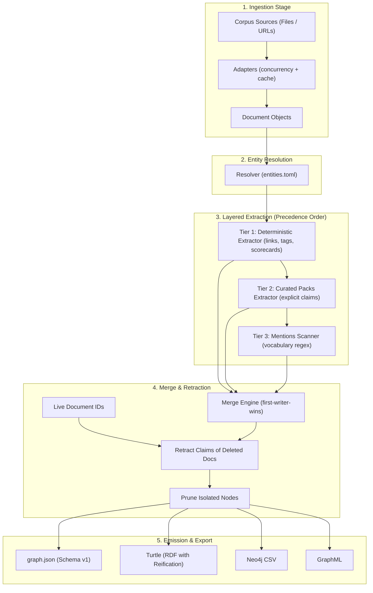
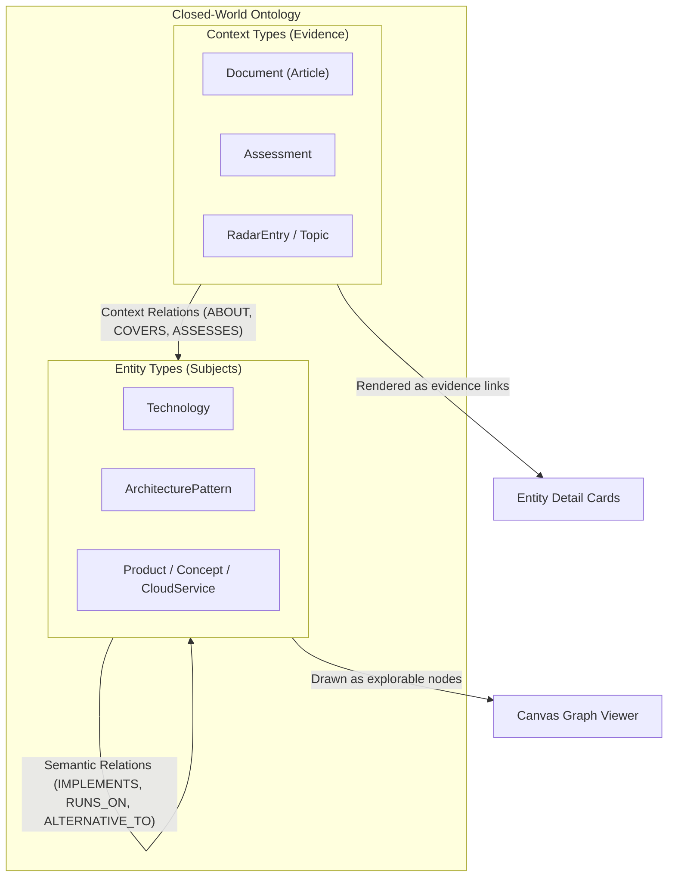

# Design notes

The README covers the contract and how to use this module. This is the
reasoning behind it — condensed from
[Build-Time Knowledge Graphs](https://shirokoff.ca/blog/build-time-knowledge-graph),
which has the full argument, the FAQ, and the search/library comparisons this
doc leaves out. Read that first if you want the narrative; read this if you
want the decision points without the story.

## Executive summary: the knowledge graph as a compiler

`corpusatlas` treats knowledge graph generation as a **static build-time compiler** problem rather than an operational database problem:

```mermaid
flowchart LR
    subgraph Sources["Corpus Sources"]
        S1["Markdown Notes (Obsidian / Logseq)"]
        S2["HTML Blog"]
        S3["Architecture Radar & Scorecards"]
        S4["Curated Entity Packs"]
        S5["Web Pages (URLs)"]
        S6["Tabular DataFrames / Arrow / Dicts"]
    end

    Sources --> Adapters["Adapters (concurrency + cache)"]
    Adapters --> Documents["Document Envelopes"]
    Documents --> Resolver["Resolver (entities.toml)"]
    Resolver --> Extraction["3-Tier Extraction"]
    Extraction --> Merge["Merge, Retract & Prune"]
    Merge --> Emit["Emission (graph.json)"]
    Emit --> Targets["Static Consumers (CDN / Browser / Exports)"]
```



For corpora under ~20,000 documents, graph databases (Neo4j, RDF triple stores) and dynamic GraphRAG indexing daemons introduce server management, availability risks, latency, and hosting costs with no payoff. The entire graph easily fits in memory and can be served as a static JSON file directly to client browsers, visualizers, or downstream tools.

Three core engineering invariants govern the design:
1. **Zero third-party dependencies**: Built entirely on the Python 3.11+ standard library (`dataclasses`, `tomllib`, `urllib`, `concurrent.futures`, `html.parser`). No supply-chain drift, no heavy packaging footprint.
2. **Deterministic, bit-identical builds**: Given identical source files, compilation yields byte-identical output with stable sorting across nodes, edges, and metadata keys. No arbitrary commit diffs on no-op rebuilds.
3. **Closed-world ontology enforcement**: Triples are strictly typechecked against a closed schema at compile time. Ill-typed or undeclared relationships fail the build rather than polluting the graph with open-vocabulary drift.

## The question that decides the architecture

Corpus size is the variable most knowledge-graph guides never state, because
most of them assume a corpus large enough that no human could hold it —
GraphRAG's regime, where expensive machinery pays for itself.

| Corpus | What actually works | Why |
| --- | --- | --- |
| Under ~1,000 docs | Build-time graph, static artifact, client-side query | Whole graph fits in memory. No server earns its keep. |
| ~1k–100k docs | Build-time graph + a real vector index | Retrieval starts to need help; traversal still cheap. |
| Over ~100k docs | Genuine GraphRAG: incremental indexing, graph DB, community summarisation | Enough structure that hierarchical summarisation adds real information. |

Treat those as heuristics, not thresholds — query concurrency, mutation rate,
query shape, latency budget and per-document extraction cost all move the
boundary as much as raw count does. This module is built for the top row and
works into the second; past that, the tradeoffs this repo makes (one writer,
no auth, ship the whole file) start working against you rather than for you.

### Concurrency, I/O and performance architecture

**What "fits in memory" actually measures like.** `scripts/profile_scale.py`
builds a synthetic, cross-linked corpus and times every pipeline stage —
real numbers, not the claim restated:

| Corpus size | Total build time | Peak RAM (`tracemalloc`) | Output artifact (`graph.json`) |
| :--- | :--- | :--- | :--- |
| **~350 docs** (typical blog) | ~0.6s | ~18 MB | ~1.2 MB |
| **5,000 docs** | 8.2s | 74 MB | 12.9 MB |
| **20,000 docs** (4x) | 27.1s | 295 MB | 52.0 MB |

#### Real-world corpus benchmark: 1,000 Wikipedia animal articles

To measure behavior against real-world, cross-linked prose with a rich domain ontology, `scripts/fetch_wikipedia_animals.py` fetches 1,000 Wikipedia animal articles via batched MediaWiki API queries, materializing an Obsidian-compatible vault and domain registry. `scripts/benchmark_animals.py` benchmarks cold and warm compilation:

| Metric | Cold Build (No Cache) | Warm Rebuild (`BuildCache`) |
| :--- | :--- | :--- |
| **Documents / Notes** | 1,000 notes (`obsidian` adapter) | 1,000 notes (`obsidian` adapter) |
| **Entity Registry** | 1,000 `Animal` entities | 1,000 `Animal` entities |
| **Graph Output** | 1,899 nodes, 1,657 edges | 1,899 nodes, 1,657 edges |
| **Total Build Time** | **13.81s** | **13.27s** (Adapter: 0.008s, 100% cache hit) |
| **Peak RAM Allocation** | **7.74 MB** | **6.30 MB** |
| **Artifact Size (`graph.json`)** | 680 KB (0.65 MB) | 680 KB (0.65 MB) |

**Stage breakdown (1,000 docs $\times$ 1,000 entity patterns):**
- **Mentions scanning (`MentionsExtractor`)**: ~13.3s (96.3% of total). Scanning 1,000 regex boundary patterns across 1,000 documents (1,000,000 evaluations) dominates execution.
- **Adapter parsing (`ObsidianAdapter`)**: ~0.46s cold, ~0.008s warm with `BuildCache`.
- **Deterministic extraction & Resolution**: ~0.04s.
- **Graph merge & JSON emission**: ~0.02s.

Reproduce with:
```bash
python3 scripts/fetch_wikipedia_animals.py 1000
python3 scripts/benchmark_animals.py
python3 -m http.server 8765 --directory viewer
# Open http://localhost:8765/
```

Build time and memory scale roughly linearly, not quadratically, in every stage.
Where the wall-clock time actually goes across corpus sizes:
1. **Adapter parsing dominates (~50–59%)**: Walking directories, markdown/HTML AST parsing, and link extraction. This is precisely what `--cache` exists to skip on rebuilds.
2. **Mentions scanning (~19–23%)**: The only extraction stage reading unstructured prose, evaluating precompiled word-boundary regex patterns over every document's text.
3. **JSON serialization (~19–23%)**: Formatting and writing the final artifact (`emit.py`), an easy-to-forget cost outside "extraction" entirely.
4. **Deterministic tier, curated packs, and merge (~1–3%)**: In-memory dictionary lookups and set operations remain near-zero cost regardless of corpus size.

**Concurrency and I/O optimizations:**
- **Concurrent multi-source loading**: When multiple `[[sources]]` are declared in `corpusatlas.toml`, `cmd_build` loads them concurrently via `concurrent.futures.ThreadPoolExecutor(max_workers=min(8, len(specs)))`. Results are collected back in configured order to ensure build determinism.
- **Whole-corpus fingerprint caching (`BuildCache`)**: For `obsidian`, `logseq`, and `html_blog` adapters, an opt-in cache tracks file mtimes, sizes, and inodes. If the whole-corpus fingerprint matches, disk reads and document parsing are bypassed entirely. A threading lock ensures safe concurrent updates across adapter threads.
- **Web adapter persistent connection pooling**: The `web` adapter maintains persistent HTTP/HTTPS connections per `(worker_thread, host)` via an internal `_ConnectionPool`, eliminating redundant TLS handshakes. It fetches pages concurrently (`max_workers=8`), respects `robots.txt` with shared cross-thread `Crawl-delay` synchronization, and deduplicates URL variants (`/path/`, `/path`, fragments) into canonical documents.
- **Viewer layout scaling**: The standalone WebGL viewer (`viewer/index.html`, built on Sigma.js and Graphology) automatically engages the Barnes-Hut $O(n \log n)$ approximation when node count exceeds `order > 200` (lowered from an earlier 2,000 cliff), avoiding brute-force $O(n^2)$ repulsive force calculations on mid-sized graphs.

This is also the answer to "should extraction run in parallel processes":
investigated, not implemented. At 20,000 documents the only genuinely
parallel-shaped extraction cost (mentions, embarrassingly parallel per
document) is a fifth of total time, and it's dwarfed by adapter parsing —
which `--cache` already addresses on every build after the first, for free,
with no new failure modes. Multiprocessing would add real complexity
(process pool lifecycle, pickling Documents/Nodes/Edges across a process
boundary) to shave a minority slice of a build nobody has actually reported
as slow — corpusatlas's one real consumer today is 70x smaller than the
size tested here. Worth revisiting if a corpus this large and this
mention-heavy actually shows up; not worth building against a corpus that
doesn't exist yet.

## Core architectural pillars and pipeline dataflow

The compiler pipeline processes data through five well-defined stages using immutable dataclass primitives:



### 1. Minimalist immutable data primitives (`model.py`)
All components agree on three frozen dataclasses:
- **`Document`**: The universal envelope yielded by every adapter (`id`, `title`, `url`, `kind`, `date`, `text`, `tags`, `links`, `meta`). Core extractors never inspect adapter internals.
- **`Node`**: The graph vertex. Contains `id`, `label`, `type` (validated against the ontology), optional `url`, `meta`, `aliases`, and `urls` dictionary (canonical / wikipedia links). Serialized with calculated `degree`.
- **`Edge`**: Directed relationship defined by `src`, `rel`, `dst`. Identity key is `(src, rel, dst, scope or "")`—ensuring scoped editorial claims (e.g., comparing tools for "streaming" vs "batch") remain distinct. Carries `prov` (provenance dictionary), `confidence` ($0.0 \dots 1.0$), `sources` (citation URLs), and a human-readable `explanation`.

### 2. Closed-world ontology system (`ontology.py`)
- **Entity vs. Context split**: Nodes are partitioned strictly into `entity_types` (what the graph is *about*, drawn on the canvas) and `context_types` (where claims were *published*, shown as links on cards).
- **Strict type signatures**: Every relation declares allowed `(source_types, target_types)`. Triples violating signatures halt compilation.
- **Relation normalisation**: Inverses (e.g. `IMPLEMENTED_BY`) are canonicalized to their primary form (`IMPLEMENTS`). Symmetric relations (e.g. `COMPARES_TO`) are canonically sorted `(min(a, b), max(a, b))` to guarantee single-edge representation.
- **Self-describing DOT export**: `corpusatlas ontology-check --dot` renders the schema's type/relation graph as Graphviz DOT.



### 3. Layered extraction hierarchy & first-writer-wins precedence
Extraction runs in three sequential tiers where **earlier tiers take absolute precedence**:
1. **Tier 1 — Deterministic (`deterministic.py`)**: Human-authored explicit structure (wikilinks, tags, scorecard options, radar calls).
2. **Tier 2 — Curated Packs (`packs.py`)**: Curated entity/relation packs. Requires explicit `confidence` and `explanation`. Ill-typed triples fail the build.
3. **Tier 3 — Extracted Mentions (`mentions.py`)**: Word-boundary regex scanning over prose. Operates *only* over the vocabulary produced by Tiers 1 and 2. Acronyms ($\le 6$ chars, all-caps) and long forms ($\ge 10$ chars) link on 1 occurrence; shorter alias forms require $\ge 2$ occurrences.

### 4. Merge, retraction, and pruning semantics (`merge.py`)
- **First-writer-wins enrichment**: If an entity is emitted by multiple extractors, the first writer's `label` and `type` are permanent. Subsequent extractors can only enrich empty fields, merge dictionary metadata, or append novel aliases.
- **Document-driven claim retraction**: Every edge carries `prov.doc`. When a document is removed from the corpus, all claims asserted by that document are retracted during `merge()`.
- **Orphan node elimination**: Any entity with zero incoming or outgoing edges after edge filtering is automatically pruned, preventing disconnected noise in visualizers.

### 5. Multi-target export & serialization (`emit.py`, `convert`)
- **`graph.json`**: Primary output with `schema_version = 1`. Formatted with deterministic sort orders for byte-identical reproducibility.
- **W3C Turtle / RDF**: `corpusatlas convert --format turtle` emits RDF triples under a configurable `--base` IRI. Uses standard `rdf:Statement` reification for provenance, confidence, and scope, preserving full compatibility with standard SPARQL 1.1 engines without requiring RDF-star extensions.
- **Neo4j CSV**: `convert --format neo4j` generates node and relationship CSVs formatted for direct ingestion via `neo4j-admin database import`.
- **GraphML**: `convert --format graphml` emits typed GraphML XML for Gephi and Cytoscape.

## Mine the structure you already wrote

A well-maintained corpus already contains a hand-authored knowledge graph,
and it's more accurate than anything extraction will produce:

| Existing signal | Graph it yields | Accuracy |
| --- | --- | --- |
| Internal links | `Article -REFERENCES-> Article` | Exact — a human chose it |
| Tags, categories | `Article -ABOUT-> Topic` | Exact, if the vocabulary is controlled |
| Frontmatter, dates | Temporal and provenance edges | Exact |
| Structured data you publish | Typed entities and scored relations | Exact |
| Prose | Everything else | Whatever your extractor manages |

Only the last row needs a model — which is why `deterministic.py` runs
first and `mentions.py` (the only tier that reads unstructured prose) runs
last, over the vocabulary the first two tiers already produced. Build the
deterministic layer, look at what's thin, and let that gap be your curated
packs' scope — not a blanket LLM pass over everything you already typed by
hand.

## The ontology has to be closed before extraction, not after

Open-vocabulary extraction over a technical corpus produces a swamp. This is
why an `Ontology` declares a closed set of entity types and, for every
relation, an explicit type signature — which entity types are valid on each
end. A pack proposing `HAS_COMPONENT` from a `Concept` fails the build before
it reaches the graph, mechanically, without anyone reviewing it by eye.

This package's own `DEFAULT` ontology is generic across *sites* — nothing in
it names any particular corpus — but specific to *this domain*, a
data-and-infrastructure-architecture vocabulary (`Technology`,
`ArchitecturePattern`, `CloudService`, and eleven more). A corpus about
biology or law wants its own types and relations, not `DEFAULT`'s — and can
have them from a schema file, without forking anything. See "Flexibility"
below.

## Entity resolution is the actual work

Extraction gives you mentions; a graph needs entities. "ClickHouse",
"Clickhouse", "CH" and "the ClickHouse engine" arrive as four strings that
have to become one node, and that decision is a domain judgement, not a
string-distance threshold. Get it wrong and the graph *looks* fine while
being useless — your most important node silently split into weakly-connected
fragments.

`entities.toml`'s job is exactly this: a hand-curated table an entity
resolves against, `options` for the exact strings that name it, `aliases`
for the rest. Never auto-merge past a threshold — a wrong merge is close to
undetectable afterwards, because the evidence two things were ever distinct
is gone. That's a review problem, not an automation problem.

## Provenance is not bookkeeping

Every edge in the artifact carries `prov.doc` (who claimed this), `prov.tier`
and `prov.extractor` (how sure the pipeline should be), and on a curated
edge, a confidence and a plain-language explanation. This is what lets
`merge.py` retract exactly the edges a deleted document made — not
"everything that happens to connect the same two entities" — and it's what
turns a wrong edge into something traceable to a document and an extractor
version, fixable as a class of error rather than a one-off patch.

## When this design is wrong

Three cases where the argument inverts:

- **The corpus is large or churns fast.** Past roughly a hundred thousand
  documents, community summarisation adds real information you can't get
  otherwise, and you need incremental indexing infrastructure — the regime
  GraphRAG was designed for.
- **Many writers, concurrent updates.** This module assumes one writer and a
  git history. Dozens of contributors editing continuously want a database
  with transactions, not a CI job.
- **Access control per node.** Shipping `graph.json` to the browser means
  shipping all of it. Per-user authorisation has to move server-side, which
  means you're deliberately building a service — not discovering you have
  one.

If none of those apply, the static build isn't a compromise. Nothing to
operate, nothing to page you, and the artifact is checkable by anyone who
reads it.

## Flexibility: what's configurable and what isn't

Three different things get asked about under "flexibility," and they have
different answers:

- **Sources.** Fully pluggable — this is the actual extension point. An
  adapter is a class with one `documents()` method; eight ship built-in
  (`html_blog`, `obsidian`, `logseq`, `web`, `entity_packs`, `radar_scorecards`,
  `radar_entries`, `dataframe`). Adding a ninth via the entry point group never
  touches the core.
- **Config.** Already flexible: everything in a `[[sources]]` block is
  adapter-specific keyword arguments, and paths resolve relative to the
  config file, not the install location.
- **Ontology.** Configurable now, as of `Ontology` becoming a value rather
  than a set of module constants — every extractor, the resolver and
  `write_graph` take `ontology=` and default to `DEFAULT` (this package's own
  14 types, 25 relations), never reaching for a module global directly. A
  corpus in a different domain gets its own types and relations from a
  `[ontology] schema` TOML file, checked at load with the same closed-world
  rules `DEFAULT` has always had to satisfy — see
  [docs/ontology-schema.md](ontology-schema.md). What's still fixed
  regardless: the `entity:`/`assessment:`/`radar:`/`topic:` id-prefix scheme,
  and the three extraction tiers themselves. Those are structural — shared by
  every ontology — not vocabulary a schema file would sensibly vary.
